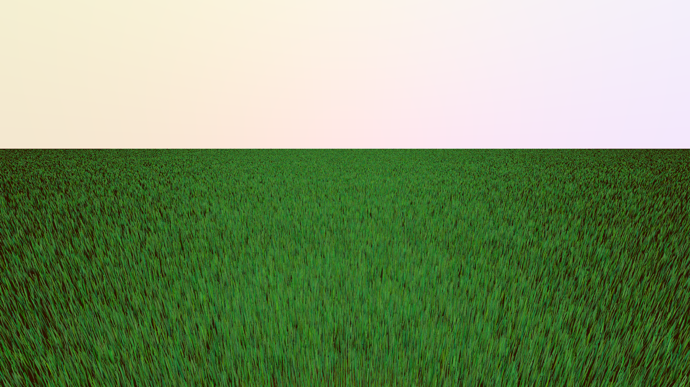

# lighter-app-grass
Program developed for my Bachelor's Thesis on tiled front to back rendering of grass blades using a compute shader.

### Abstract
This thesis describes the implementation of a new method of rendering grass in real time. The approach uses a compute shader to draw every single grass blade in parallel by separating the screen into tiles, each of them worked on by a work group of 32 threads. The grass blades in each tile are rendered front to back to avoid using depth tests for obstruction and be able to only draw visible parts of grass blades. 
The developed program produces a good approximation for medium to far distance grass at a reasonable speed. The implementation can't compete with image-based methods but with further optimizations may prove valid as an alternative to geometry-based grass for medium to far distances.

The thesis can be found [here](./thesis.pdf) (German)

A video showcasing the implementation cann be found at (https://vimeo.com/189309577)

The program is based upon https://github.com/tszirr/lighter-app/tree/f7cec6d0a04f8d92d007136ca0f1e280eddafc7f
